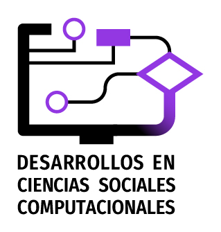

```{r setup, echo=FALSE, results='asis'}

# por favor, no modificar!
# los datos se toman de metadatosJSON

knitr::opts_chunk$set(echo = TRUE, warning = FALSE, message = FALSE)
suppressMessages(suppressWarnings(library(jsonlite)))

library(jsonlite)
metadata <- fromJSON('metadatos.json')

# estilos ------

estilos <- "
<style>
body {
  font-family: 'Fira Sans Condensed', sans-serif;
  font-weight: 400;
  color: #333;
  line-height: 1.6;
  margin: 20px auto;
  padding: 10px;
  max-width: 1200px;
}

h1.title {
    display: none;
}

.encabezado {
  display: flex;
  align-items: center;
  border-bottom: 2px solid #B8BCC2;
  padding-bottom: 10px;
  margin-bottom: 20px;
}

.encabezado img {
  height: 80px;
  margin-right: 20px;
}

.encabezado h1 {
  line-height: 90%;
}

h1, h2 {
  color: #9237E2;
  font-family: 'Fira Sans Condensed', sans-serif;
  font-weight: 700;
}

h1 {
  font-size: 2.5em;
  margin: 0;
}

h2 {
  font-size: 1.9em;
  margin-top: 20px;
  margin-bottom: 10px;
}

.encabezado p {
  margin: 5px 0;
  color: #666;
  font-family: 'Fira Sans Condensed', sans-serif;
  font-weight: 400;
}

footer {
  text-align: center;
  font-size: 0.9em;
  margin-top: 40px;
  color: #666;
}

h1.titulo-es {
  font-weight: bold;
  color: #9237E2;
  line-height: 95%;
}

h2.titulo-en {
  font-weight: 400;
  font-size: 1.7em;
  color: #9237E2;
  margin-top: 5px;
  line-height: 95%;
}

.tag-list {
  display: flex;
  flex-wrap: wrap;
  gap: 8px;
}

.tag {
  padding: 4px 8px;
  border-radius: 12px;
  background-color: #eef2ff;
  color: #3366cc;
  font-size: 0.85em;
  font-weight: 600;
  text-align: center;
  border: 1px solid #d0d7de;
  box-shadow: 0 1px 2px rgba(0, 0, 0, 0.1);
  transition: background-color 0.2s, color 0.2s;
}

.data-header {
  border: 1px solid #ddd;
  padding: 8px;
  text-align: right
}

.data-content {
  border: 1px solid #ddd;
  padding: 8px;
}

.abstract {
  font-size: 1em;
  color: #333;
  text-align: center;
  font-style: italic;
  line-height: 95%;
  min-width: 500px;
  max-width: 800px;
  margin: 12px auto 12px auto;
}
.authors {
  text-align: center;
  font-size: 1em;
  color: #333;
}
.cita {
  font-size: 1em;
  color: #333;
  text-align: center;
  line-height: 95%;
  min-width: 500px;
  max-width: 800px;
  margin: 12px auto 12px auto;
}


footer {
   text-align: center;
   font-size: 0.9em;
   margin-top: 40px;
   color: #666;
}
</style>
"

# metadatos -----

cat('
<title>', metadata$title_sp, ' | DCSC</title>
<meta http-equiv="Content-Type" content="text/html; charset=utf-8" />
<meta name="description" content="', metadata$abstract_sp, '" />
<meta name="keywords" content="', paste(metadata$keywords_sp, collapse = ', '), '" />
<meta name="DC.Language" content="', paste(metadata$language, collapse = ', '), '" />
<meta name="DC.Type" content="', metadata$type, '" />
<meta name="DC.Format" content="', paste(metadata$format, collapse = ', '), '" />
<meta name="DC.Creator.PersonalName" content="', paste(metadata$authors_name, collapse = '"/><meta name="DC.Creator.PersonalName" content="'), '" />
<meta name="DC.Creator.Affiliation" content="', paste(metadata$authors_affiliation, collapse = '"/><meta name="DC.Creator.Affiliation" content="'), '" />
<meta name="DC.Creator.ORCID" content="', paste(metadata$authors_orcid, collapse = '"/><meta name="DC.Creator.ORCID" content="'), '" />
<meta name="DC.Creator.Email" content="', paste(metadata$authors_email, collapse = '"/><meta name="DC.Creator.Email" content="'), '" />
<meta name="DC.Identifier" content="', metadata$identifier, '" />
<meta name="DC.Identifier.URI" content="', metadata$identifier_uri, '" />
<meta name="DC.Source" content="', metadata$source, '" />
<meta name="DC.Source.Volume" content="', metadata$source_volume, '" />
<meta name="DC.Source.Issue" content="', metadata$source_issue, '" />
<meta name="DC.Source.ISSN" content="', metadata$source_issn, '" />
<meta name="DC.Date.Created" content="', metadata$date_created, '" />
<meta name="DC.Date.Issued" content="', metadata$date_issued, '" />
<meta name="DC.Date.Modified" content="', metadata$date_modified, '" />
<meta name="DC.Publisher" content="', metadata$publisher, '" />
<meta name="DC.Format.extent" content="', metadata$publisher, '" />
<meta name="DC.Subject" content="', metadata$section, '" />

<link href="https://fonts.googleapis.com/css2?family=Fira+Sans+Condensed:wght@300;400;600;700&display=swap" rel="stylesheet">',
estilos, file = "custom-head.html")

# encabezado -----

cat('<div style="margin-bottom: 20px;">')

# Logo y nombre de la revista con títulos
cat('<div style="display: flex; align-items: flex-start; margin-bottom: 20px;">')
cat('')
cat('<div>')
cat('<p style="margin: 20px 0px; color: #666;">Revista <strong>', metadata$source, '</strong> Vol. ', metadata$source_volume, ' (', metadata$source_issue, '), ', metadata$pages, '</p>', sep = "")
cat('<h1 class="titulo-es" style="font-size: 1.8em; margin: 10px 0; color: #9237E2;">', metadata$title_sp, '</h1>')
cat('<h2 class="titulo-en" style="font-size: 1.4em; margin: 0; color: #666;">', metadata$title_en, '</h2>')
cat('</div>')
cat('</div>')

cat('</div>')

# cat('<div style="margin-bottom: 20px;">')
# cat('<h1 class="titulo-es">', metadata$title_sp, '</h1>')
# cat('<h2 class="titulo-en">', metadata$title_en, '</h2>')

# Autores con datos
for (i in seq_along(metadata$authors_name)) {
  cat('<p class="authors">',
      metadata$authors_name[i], 
      ' (', metadata$authors_affiliation[i], ') <br/>', 
      metadata$authors_email[i] , ' ',
      '<a href="', metadata$authors_orcid[i], '" target="_blank">', metadata$authors_orcid[i], '</a>',
      '</p>', sep = "")
}

# Abstract y keywords en español
cat('<p class="abstract"><strong>Resumen:</strong> ', 
    metadata$abstract_sp, '</p>')
cat('<p class="abstract"><strong>Palabras clave:</strong> ', 
    paste(metadata$keywords_sp, collapse = ", "), '</p>')

# Abstract y keywords en inglés
cat('<p class="abstract"><strong>Abstract:</strong> ', 
    metadata$abstract_en, '</p>')
cat('<p class="abstract"><strong>Keywords:</strong> ', 
    paste(metadata$keywords_en, collapse = ", "), '</p>')

# Fechas
cat('<p class="abstract"><strong>Recibido:</strong> ', 
    metadata$date_created, 
    ' | <strong>Aceptado:</strong> ', 
    metadata$date_issued, '</p>')

format_apa_authors <- function(authors) {
  formatted <- sapply(authors, function(name) {
    parts <- strsplit(name, " ")[[1]]
    last_name <- tail(parts, 1)
    initials <- paste(substr(parts[-length(parts)], 1, 1), collapse = ". ")
    paste(last_name, paste0(initials, "."))
  })
  if (length(formatted) > 1) {
    paste(paste(formatted[-length(formatted)], collapse = ", "), "&", formatted[length(formatted)])
  } else {
    formatted
  }
}

cat('<p class="cita"><strong>Cita APA:</strong> ', 
    format_apa_authors(metadata$authors_name), ' (',
    substr(metadata$date_created, 1, 4), '). ', 
    metadata$title_sp, '. ', '<i>', metadata$source, '</i> ', 
    metadata$source_volume, ' (', metadata$source_issue, ')',
    ', ', metadata$pages, 
    '</p>', sep = "")

# Tabla de URLs
cat('<table style="width: 100%; border-collapse: collapse; margin-top: 10px;">')
cat('<tr style="background-color: #f2f2f2; text-align: left;">',
    '<th class="data-header">Recurso/Resources</th>',
    '<th class="data-content">URL</th></tr>')

url_types <- c("Repositorio/Repository", 
               "Archivo/Archive", 
               "Documentación", 
               "Vignette", 
               "Demo", 
               "Licencia/Licence")
urls <- c(metadata$repository_url, 
          metadata$archive_url, 
          metadata$documentation_url, 
          metadata$vignette_url, 
          metadata$demo_url, 
          metadata$licence_url)
for (i in seq_along(url_types)) {
  if (urls[i] != "") {
    cat('<tr>',
        '<td class="data-header">', url_types[i], '</td>',
        '<td class="data-content"><a href="', urls[i], '" target="_blank">', urls[i], '</a></td>',
        '</tr>')
  }
}

cat('<tr>',
        '<td class="data-header">Lenguajes/Languages Formatos/Formats</td>',
        '<td class="data-content">')

cat('<div class="tag-list">')
for (tech in metadata$techonologies) {
  cat('<div class="tag">', tech, '</div>')
}
cat('</div>')
cat('</td></tr>')
cat('</table>')

cat('</div>')

```

## Justificación

mincaqdasr es una herramienta para análisis cualitativo (CAQDAS), diseñada específicamente para asistir en la tarea de codificar o anotar un corpus de documentos breves a través de una interfaz web. 
En investigación cualitativa, este proceso de anotación es conocido como “codificación”, definido como “... una palabra o frase breve que simbólicamente asigna un atributo sintético, saliente, esencial y/o evocativo a una porción de datos basados en el lenguaje” [@saldaña2016, p. 3]. Este proceso suele ser uno de los primeros pasos en un diseño espiralado o por etapas, donde los códigos se integran en temas y argumentos para conceptualizar y desarrollar una narrativa teórica [@auerbach2003].

La herramienta ofrece una interfaz gráfica sencilla que permite identificar y resaltar fragmentos de texto, crear e imputar códigos, y registrar memos o comentarios. El resultado de la codificación se exporta en formato JSON (JavaScript Object Notation), un estándar que puede ser manipulado desde cualquier lenguaje de análisis de datos, como R o Python. De este modo, mincaqdasr promueve la transparencia y la colaboración en la investigación cualitativa.

Construida como una aplicación web autónoma, mincaqdasr puede ejecutarse en cualquier navegador que tenga JavaScript habilitado. Su diseño minimalista se centra exclusivamente en las tareas esenciales para la codificación, dejando al investigador la flexibilidad de gestionar otras etapas del análisis cualitativo, como la limpieza de datos, el manejo de documentos o la construcción de tablas y redes temáticas, utilizando los flujos de trabajo que considere más convenientes.

El corpus se puede cargar como un vector simple de texto, eliminando la necesidad de crear carpetas o paquetes (bundles) como en otras herramientas. Para facilitar el trabajo en R, mincaqdasr incluye funciones para iniciar la interfaz como una shinyapp y para manipular el archivo JSON resultante de la codificación.

## Estructura de los datos

Los datos se guardan en un archivo JSON que incluye 4 elementos: 

- documentos (como un vector de texto); 
- códigos (un vector de texto);
- anotaciones a nivel documento, referenciando uno o varios códigos y un memo del anotador;
- anotaciones a nivel fragmento, referenciando uno o varios códigos y un memo del anotador;

Incluimos dos ejemplos breves de codificaciones en formato JSON. El primero retoma fragmentos del trabajo de M. Zizi en el proyecto "The Yeshiva University Fatherhood Project", que Auerbach y Silverstein (2003) presentan en su libro, ilustrando paso a paso las tareas clave del análisis cualitativo: desde la lectura y selección de fragmentos hasta la asignación de códigos y su elaboración conceptual. Con mincaqdasr, es posible registrar todas estas tareas, excepto la última.

El segundo ejemplo contiene fragmentos de noticias de la prensa argentina sobre “big data”. En este caso, no se asignan códigos a fragmentos específicos; en su lugar, cada documento se clasifica con una etiqueta "positivo" o "negativo", según mencione una aplicación beneficiosa o un riesgo. Otras tareas de análisis con este corpus se detallan en otro material propio [@cursor].

## Otras herramientas

Existen varias herramientas comerciales para asistir en el análisis cualitativo (CAQDAS). Las más conocidas son NVivo, Maxda o Atlas.ti, que incluyen varias funciones de manejo de documentos y análisis, y que trabajan con varios formatos de documentos, no sólo textuales. 
A diferencia de estas, mincaqdasr es gratuita y de código abierto, y se limita a texto plano y no cubre funciones más allá de las necesarias para anotar o codificar, lo que puede ser conveniente cuando el investigador maneja su flujo de trabajo en un lenguaje de análisis de datos como R.

En R se encuentra disponible el package qcoder [@qcoder2024] que también permite la codificación a través de una interfaz gráfica que, además, permite la exploración de códigos y fragmentos. Sin embargo, tiene un manejo del proyecto y sus archivos mucho más estructurado, de modo que puede resultar más dificil de integrar en un código más amplio. No conocemos  otros proyectos activos --y se debe advertir que qcoder no parece haber tenido actualizaciones en los últimos años-- que cumplan funciones de CAQDAS. 

## Referencias

<div id="refs"></div>

```{r footer, echo=FALSE, results='asis'}

cat('<footer>',

  '<p>', 
  'Revista <strong>Desarrollos en Ciencias Sociales Computacionales</strong> | ISSN: en trámite <br/>',
  '<a href="https://revistadesarrollos.uflo.edu.ar/">https://revistadesarrollos.uflo.edu.ar/</a> <br/>',
  'Licenciatura en Sociología / Facultad de Psicología y Ciencias Sociales / Universidad de Flores, Argentina <br/>',
  '</p>',
  
  '</footer>')

```
